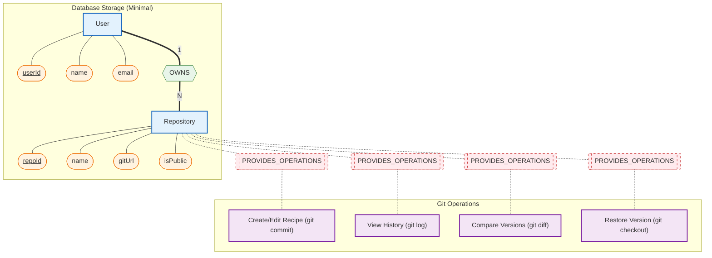

```mermaid
graph TD
    %% Minimal Database Entities
    subgraph "Database Storage (Minimal)"
        %% Core Database Entities
        User["User"]
        Repository["Repository"]
        
        %% Key Attributes
        User --- userId(["userId"])
        User --- userName(["name"])
        User --- userEmail(["email"])
        
        Repository --- repoId(["repoId"])
        Repository --- repoName(["name"])
        Repository --- gitUrl(["gitUrl"])
        Repository --- isPublic(["isPublic"])
        
        %% Core Relationship
        User === |"1"| OWNS{{"OWNS"}} === |"N"| Repository
    end
    
    %% Git Operations (Not Database Entities)
    subgraph "Git Operations"
        GitOperation1["Create/Edit Recipe (git commit)"]
        GitOperation2["View History (git log)"]
        GitOperation3["Compare Versions (git diff)"]
        GitOperation4["Restore Version (git checkout)"]
    end
    
    %% Cross-System References
    Repository -.- PROVIDES_OPERATIONS[["PROVIDES_OPERATIONS"]] -.- GitOperation1
    Repository -.- PROVIDES_OPERATIONS2[["PROVIDES_OPERATIONS"]] -.- GitOperation2
    Repository -.- PROVIDES_OPERATIONS3[["PROVIDES_OPERATIONS"]] -.- GitOperation3
    Repository -.- PROVIDES_OPERATIONS4[["PROVIDES_OPERATIONS"]] -.- GitOperation4
    
    %% Styling
    classDef databaseEntity fill:#E3F2FD,stroke:#1565C0,stroke-width:2px
    classDef gitOperation fill:#F3E5F5,stroke:#7B1FA2,stroke-width:2px
    classDef attribute fill:#FFF3E0,stroke:#EF6C00,stroke-width:1px
    classDef keyAttribute fill:#FFF3E0,stroke:#EF6C00,stroke-width:1px,text-decoration:underline
    classDef databaseRelationship fill:#E8F5E9,stroke:#2E7D32
    classDef operationRelationship fill:#FFEBEE,stroke:#C62828,stroke-dasharray:5
    
    class User,Repository databaseEntity
    class GitOperation1,GitOperation2,GitOperation3,GitOperation4 gitOperation
    class userId,repoId keyAttribute
    class userName,userEmail,repoName,gitUrl,isPublic attribute
    class OWNS databaseRelationship
    class PROVIDES_OPERATIONS,PROVIDES_OPERATIONS2,PROVIDES_OPERATIONS3,PROVIDES_OPERATIONS4 operationRelationship
```